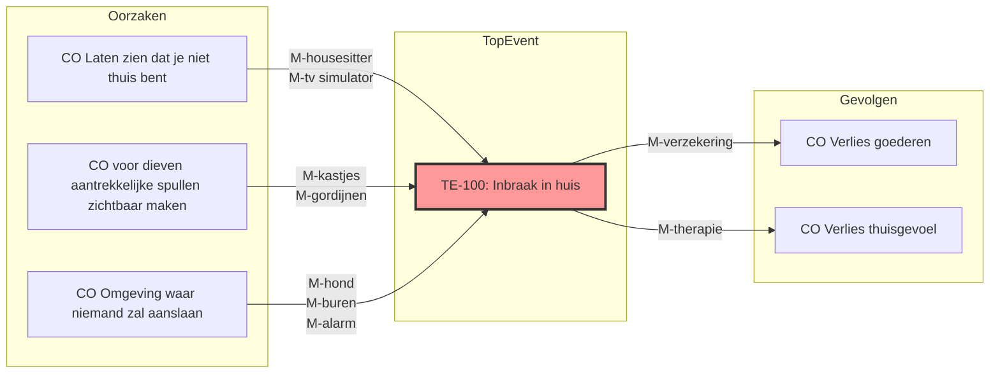
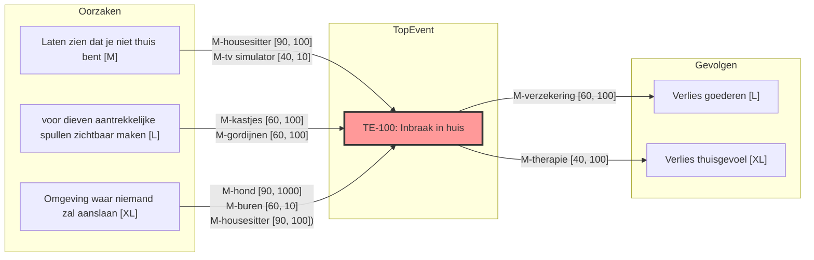

# Werkwijze geïntegreerde risico workshop
## Waarom ook alweer
### Snelheid door vermindering overlap
Beoordelingen vanuit verschillende specialisaties ontdekken vaak dezelfde oorzaken en gevolgen en belichten die vanuit één hoek. Door dit gelijktijdig en samen te doen, kunnen overeenkomsten en verschillen sneller gevonden en geplaatst worden. Dit maakt het totale risico-landschap overzichtelijker.
### Wenselijke antwoorden voorkomen
Door te beginnen vanuit een "wet van Murphy" gedachte en met een positieve houding zowel uitdagingsgericht als ontwerpend te werk te gaan, verminderen we zelfcensuur, pro-forma gedrag en wenselijke antwoorden. 
### Herbruikbaarheid
We publiceren de vlinderdassen (zonder inschattingen en maatregelen) als publieke en herbruikbare zaken. Organisaties die een vergelijkbaar product gaan ontwerpen, hoeven niet vanaf 0 te beginnen. Toezichthouders kunnen bepaalde vlinderdassen gaan herkennen en zo voorkomen dat dezelfde zaken steeds opnieuw in honderden pagina's gevariëerde tekst worden toegelicht.
### Doorlopend monitoren
We kunnen zien wanneer de door ons gebruikte vlinderdassen worden aangepast, ook zonder dat we daar zelf continu aan werken. Zo kunnen we onze risico-inperking up to date houden. 
### Betere uitlegbaarheid
De vlinderdasmethode is een optimale combinatie van compleetheid en begrijpelijkheid. Het maakt waardevolle gesprekken mogelijk. Zelfs waar deze weergave tekort schiet, is het duidelijk en kunnen nuances toegelicht worden.
### Machine leesbaar en versioneerbaar
Om deze diagrammen te maken, gebruiken we de Mermaid taal. Dit maakt dat er geen extra programma's nodig zijn om de diagrammen aan te passen, dat machines gemakkelijk de diagrammen eenduidig kunnen begrijpen en dat aanpassingen tot op de letter bijgehouden kunnen worden.  
## Vlinderdas diagrammen
### Kort overzicht
Een vlinderdas diagram geeft een overzicht van een onwenselijke gebeurtenis **(Top Event, TE)** en wat de oorzaken en gevolgen zijn. De stroom tussen **oorzaak** en **gevolg** wordt "causaal" genoemd: een **Causale Stroom, of CS**. En omdat het gevolg van het een een oorzaak kan zijn van het ander, hebben deze dingen de naam **"Causale Objecten", of  CO**. Een **risico** bestaat waar een **impact** en een **waarschijnlijkheid** bij elkaar komen. De oorzaken hebben dan een waarschijnlijkheid en de gevolgen een impact. En het hele doel van alles, is dat we de impact zo laag mogelijk maken. Dat doen we door **blokkades** in de causale stromen aan te brengen. Het liefst meerdere per stroom, want geen enkele maatregel blokkeert alles. Maar door laagjes gatenkaas over elkaar te leggen, kunnen we zo veel mogelijk de **totale impact** verlagen. Uiteindelijk blijft het een afweging van degene die beslissingen neemt en de verantwoordelijkheid draagt, om te kiezen hoe veel risico die accepteert. Per slot van rekening is de enige maatregel die alle risico's naar 0 brengt, om het geheel niet te laten doorgaan. En dat is vaak ook niet wat voor iedereen het beste is. Een **maatregel** is trouwens de gekozen vorm van een blokkade: als je wil voorkomen dat iemand je huis binnenkomt, is een blokkade dat de deur alleen voor jou opengaat. Een maatregel is dan een cilinderslot, of een cijferslot, of een electronisch slot of een portier. 

### Hoe wij het gebruiken
We hebben een aantal keuzes gemaakt in hoe wij de vlinderdas diagrammen gebruiken. 
* **"Top Event" zonder "hazard"**. Het gevaar is namelijk in alle gevallen hetzelfde: onvoldoende risico-beperkende maatregelen.
* Zo **enkelvoudig** mogelijk. Sommige COs werken trapsgewijs, hebben een effect op elkaar of leiden weer tot nieuwe TE's. Omwille van de overzichtelijkheid doen we dit niet. Dit betekent dat we beslissen om bepaalde interacties en nuances niet weer te geven. We gaan ervan uit, dat dit er dusdanig weinig zijn, dat die los besproken kunnen worden. Door elke TE, CO en M een nummer te geven, kunnen we goed aangeven waar dingen ingewikkelder in elkaar zitten, dan we ze weergeven. Per TE wordt aangenomen dat de causale objecten onafhankelijk zijn tenzij expliciet anders genoteerd. Waar nodig kunnen we de methoden volgens Leveson STAMP hanteren.
* **Granulair risico**. Meestal wordt het totale risico van een TE in z'n geheel in een vijf bij vijf matrix weergegeven: vijf stappen impact, vijf stappen waarschijnlijkheid. Maar wij gebruiken per stroom en per impact een waarschijnlijkheid en gevolg. Zo kunnen we per blokkerende maatregel inschatten hoe goed deze werkt. Want uiteindelijk willen we een op prioriteit gesorteerde lijst van maatregelen maken. 
* **Granulair effect**. Elke maatregel heeft zowel een blokkerende werking, als een negatief effect op het te beoordelen systeem zelf. Dat negatieve effect kan een kostenpost zijn, maar ook dat het systeem minder prettig in het gebruik wordt.
* **Gekozen eenheden**. Voor zowel waarschijnlijkheid als impact kiezen we voor de T-shirt size. S, M, L, eventueel uit te breiden met XS en XL. Om in de wasgoed metafoor te blijven, hebben maatregelen een wastemperatuur als effect: 40°, 60°, 90°. Maar het negatieve effect op het systeem drukken we uit in euro's en dan in €10,-, €100,- of €1.000,- Zo kunnen we zowel de kosten van de maatregel, als de verlaging van de gehoopte winst in één cijfer uitdrukken.
* **Hergebruik belonen**. Een enkele maatregel kan in diverse stromen, op diverse TE's bijdragen. Elk met een eigen temperatuur en kosten. Maar hoe vaker een enkele maatregel gebruikt wordt, hoe meer die ene maatregel bijdraagt aan de totale impact verlaging. Dat wordt dan een belangrijker maatregel, die hoger in de lijst komt te staan. De hoogste kosten tellen. en tellen niet op.
* **Zelfstandigheid**.  Een maatregel moet zo veel mogelijk op zichzelf kunnen staan en geen onderlinge afhankelijkheden hebben.
* **Detectie inbouwen**. Elke maatregel biedt idealiter een handvat voor monitoring en detectie.
* **Voorbeeld Impact**. de impact van een gevolg kan verschillen per betrokkene, of "stakeholder". De impact van de zwaarst geraakte stakeholder telt. We gaan steeds systematisch de relevante stakeholders langs. Dus waar die voor de ene XS is, een paar anderen M en voor één groep betrokkenen XL, dan is de impact: XL.
* **Waarden toekennen om mee te rekenen**. 
	* Een enkele blokkade verlaagt met 1, 2 of 3 t-shirt sizes, maar nooit naar 0; het kleinst is XS. 
	* Om te rekenen met T-shirt sizes gebruiken we: XS: 2,  S: 3, M: 5. L: 8, XL: 13.
	* De impacten van één TE tellen we bij elkaar op voor de bepaling van de blokkerende waarde van één maatregel. 
	* **Gatenkaas bonus**. Maatregelen die samen in stroom zitten tussen CO en TE vangen elkaars gaten op. Dit doen we door per gecombineerde maatregel voor de bijbehorende CO één punt af te trekken, met een minimum van 1.
	* **Onschatbare waarden**. Waar het vertrouwen in de juistheid van een schatting laag is, markeren we dit. Daarmee wordt automatisch een slag om de arm van -1 en +1 genomen in de berekeningen.

### Rekenen met risico's

* Totale impact is: L + XL = 8+13 = 21 punten
* zonder enige maatregel is het risico: M x 21 + L x 21 + XL x 21 = (5+8+13) x 21 = 546 punten
* de verlagende waarde van de housesitter alleen is: M - (90° x M) + XL - (90° x XL) = (5-2) + (13 - 3) = 13
* Dus met alleen een housesitter, is het risico nu: XS * 21 + L x 21 + S x 21 = (2+8+3) x 21 = 273
* de kosten van de housesitter zijn 100.
* als we een housesitter, een hond en een verzekering nemen, wordt het:
XS x (S + XL) + L x (S + XL) + XS-1 + (S + XL) = (2 + 8 + 1) x (3 + 13) = 11 x 16 = 176 maar kost het 1200.

Hoe komen we dan vanaf hier naar een lineaire lijst van maatregelen, want er zijn interacties. Enerzijds vangen maatregelen elkaars gaten op, anderzijds kan het zijn dat een extra maatregel in dezelfde CS steeds minder opbrengt: afnemende meeropbrengsten of *diminishing returns*. 
Wat we doen, is bepalen welke enkele maatregel ín een TE het meest kosteneffectief is in totaal. Dan berekenen we daarna de set van daarop volgende maatregelen, enzovoort, tot we een punt bereiken dat de kosten steeds minder baten opleveren.
#### stap 1: alle maatregelen individueel
| maatregel   | nieuw risico | reductie | kosten | reductie/€ |
| ----------- | ------------ | -------- | ------ | ---------- |
| housesitter | 273          | 273      | 100    | **2,73**   |
| hond        | 357          | 189      | 1000   | 0,19       |
| buren       | 441          | 105      | 10     | **10,5**   |
| gordijnen   | 420          | 126      | 100    | 1,26       |
| kastjes     | 420          | 126      | 100    | 1,26       |
| verzekering | 378          | 168      | 100    | 1,68       |
| therapie    | 462          | 84       | 100    | 0,84       |
Beste reductie per euro: **buren**
Nieuwe baseline: 441

#### Stap 2 extra effect bovenop buren
| maatregel   | nieuw risico | extra reductie | kosten | reductie/€ |
| ----------- | ------------ | -------------- | ------ | ---------- |
| housesitter | 252          | 189            | 100    | **1,89**   |
| gordijnen   | 357          | 84             | 100    | 0,84       |
| kastjes     | 357          | 84             | 100    | 0,84       |
| verzekering | 294          | 147            | 100    | 1,47       |
| hond        | 336          | 105            | 1000   | 0,11       |
| therapie    | 357          | 84             | 100    | 0,84       |

Beste: **housesitter**
Nieuwe baseline: **252**
#### Stap 3: bovenop buren + housesitter
| maatregel   | nieuw risico | extra reductie | kosten | reductie/€ |
| ----------- | ------------ | -------------- | ------ | ---------- |
| verzekering | 210          | 42             | 100    | **0,42**   |
| gordijnen   | 210          | 42             | 100    | 0,42       |
| kastjes     | 210          | 42             | 100    | 0,42       |
| hond        | 231          | 21             | 1000   | 0,02       |
| therapie    | 210          | 42             | 100    | 0,42       |
Alle vergelijkbaar; kies goedkoopst/praktischst.  
Bijv. **verzekering**
Nieuwe baseline: **210**

#### Stap 4: afnemende restwaarde
Nu hebben we voor 10+100+100 = 220 een reductie tot 210 gerealiseerd. Hoewel dit minder is dan de 176 die we met de hond erbij hadden, is dit in dit geval wel de zinnigste keuze. Pas wanneer we andere TE's erbij nemen en bijvoorbeeld de hond elders ook baten gaat hebben, dan worden andere combinaties beter.

####  Toelichting inschalingen
De logica van de waardering van de buren (10), housesitter (100) en hond (1000) gaan over de investering vs de last op het systeem. Die buren heb je al en die 10 is om een paar keer leuk koffie met ze te drinken en aan ze te denken met verjaardagen e.d. Je houdt een oogje bij hun in het zeil tijdens hun vakanties en dat is wederzijds. Die housesitter is zoekwerk, afstemwerk (de ervaring leert dat passende housesitters ook vaak vakantieplannen hebben) en brengt meer kosten met zich mee dan wat koffie en af en toe een cadeautje. Hoewel een hond een grote bron van vreugde kan zijn, als je die alleen en uitsluitend voor de bewaking neemt, dan is het nogal een investering in tijd en geld: elke dag meerdere keren uitlaten, voer- en dierenartskosten en bovendien in diezelfde vakanties weer oppas voor de hond. 
Mocht het echt niet passen om in ordes van grootte (factor 10) te denken, pas het alleen dan aan.
## Uitkomsten in fasen
### Fase 1: eigen inbreng
Je brengt je eigen invalshoek vanuit een expertise mee. Je hebt in grote lijnen en eenvoudige taal kunnen lezen waarom we dit systeem nuttig vinden en het waard vinden om enig risico te lopen. Maar in deze fase gaan we nog niet belasten en inperken met wat er al is. Dit geeft de mogelijkheid om de volledige breedte van alle deelnemende expertises te vinden. Het kan goed zijn, dat jij als enige een bepaalde CO of TE inbrengt.
### Fase 2: combineren met verplichte inbreng (algemeen)
We hebben een verzameling TE's, CO's en M opgesteld, die zaken uit diverse vereisten bij elkaar brengt. Het is waarschijnlijk dat sommige van jouw CO's en TE's sterk overeenkomen en misschien direct te plaatsen zijn. Maar het kan ook dat er nieuwe TE's toegevoegd, gesplitst of samengevoegd moeten worden.
### Fase 3: combineren met ontworpen maatregelen (voor dit systeem)
In het ontwerp voor het systeem is al een aantal maatregelen genomen. Die zijn soms 1:1 te plaatsen in de verplichte inbreng, maar soms vereisen deze weer nieuwe TE's. Na deze fase verwachten we een compleet beeld van de TE's en CO's te hebben.
### Fase 4: ontbrekende maatregelen ontwerpen
In welke CS zit nu nog geen blokkade? Daar moet in ieder geval een soortnaam voor worden beschreven. En liefst per blokkade minstens één maatregel voorstellen.
### Fase 5: waarschijnlijkheden, impact, positieve en negatieve effecten
Nu hebben we alle TE compleet en kunnen we de inschattingen gaan doen. Het zijn veel inschattingen en consensus, hoewel wenselijk, is niet per sé nodig of mogelijk; voor sommige CS zullen alleen specifieke deskundigen een inschatting kunnen maken. Maar discussie is hier wel waardevol en bij twijfel hanteren we de ongunstigste schatting. We gaan ervan uit dat de meest invloedrijke zaken ingeschat kunnen worden.
## Lijst van deliverables
### Verplichte inbreng (publiek)
Dit is de verzameling die in fase 2 wordt ingebracht, verrijkt met onze inzichten. Het bevat TE's, CO's en blokkades (geen maatregelen). Het is systeem-onafhankelijk. Het is een eerste inschatting en interpretatie van de wet- en regelgeving en we verwachten dat deze verfijnd zal moeten worden. Door deze te publiceren, stellen we ons hiervoor open.
### Ontworpen maatregelen (publiek)
Dit hoort bij het systeemontwerp. Het publiceren in deze vorm maakt de relatie tot risico-beheersing duidelijker, dan wanneer we dit alleen als tekst publiceren.
### Gehanteerde Vlinderdassen (publiek)
Dit is het resultaat van de workshop, waarbij we alleen de TE's en CO's delen, met de verplichte blokkades. De vooraf in het systeem ontworpen maatregelen nemen we niet mee.
### Ontbrekende maatregelen (intern)
Dit is het complete beeld van blokkades, maatregelen in de context van TE's en eventuele verplichte blokkades.
### Completerende inschattingen
Deze weergave voegt de inschattingen toe aan de TE's en maatregelen.
### Dekkingsgraad per wet
Omdat we weten welke TE, CO en M vanuit welke wet afkomstig is, kunnen we per wet een dekkingsgraad opstellen. Ontbrekende verplichtingen kunnen zo worden afgedekt.
### Geprioriteerde lijst van te implementeren maatregelen
Dit is een overzicht van de meest gunstige set maatregelen per TE en in totaal, met numerieke waarden voor restrisico's per gekozen maatregel.
### Management samenvatting
Een overzicht van de belangrijkste bevindingen, keuzes en risico's.
## Wat is het vervolg
### Overleg beslissingsbevoegde: keuzes maken, eigenaars aanwijzen
De beslissingsbevoegde maakt keuzes in de maatregelen en daaruit volgt direct een waarde voor de te accepteren restrisico's. De berekeningen ondersteunen besluitvorming en zijn geen exacte voorspellingen. De gekozen set maatregelen en het restrisico worden expliciet geaccepteerd door de beslissingsbevoegde. Elke maatregel krijgt een eigenaar die verantwoordelijk is voor beheer en monitoring.
### Opstellen vormvaste documentatie
Hoewel deze deliverables rijker, begrijpelijker en informatiedichter zijn dan sommige reguliere vormen van documentatie, is het verplicht om bepaalde zaken volgens een vast stramien op te stellen. Met de deliverables, samen met de systeembeschrijving en dit document, is dit bijna een invuloefening.
### Overleg met (beoogde) toezichthouder
De aanpak, resultaten en berekeningen worden besproken met de (beoogde) toezichthouder(s). We beogen te komen tot herhaalbare voorbeelden van wat wel en niet tot een nieuwe werkwijze kan gaan behoren. We mikken hierbij niet alleen op een positief oordeel over onze risico-beheersing voor het besproken systeem, maar voor deze methode en de vorm van de deliverables als geheel. 
### Mogelijkheid tot vaststellen bespreken
Naast een informele afstemming, zal een keuze gemaakt moeten worden, of wat we tot nu toe geproduceerd hebben kan gaan gelden als de formele documentatie voor de risico-beheersing.
### Doorlopend monitoren
Nieuw aan deze aanpak, is dat dit blijft doorlopen na de momentopname. Door bepaalde deliverables te publiceren, kunnen ze meegroeien met de inzichten en ervaring uit het veld. Omdat we een berekenende aanpak hebben gekozen, kunnen we wijzigingen in de risico-analyses snel vertalen naar nieuwe keuzes en wegingen in de gekozen aanpak voor risico-beheersing. Dit is zelf een onderdeel van het risico management systeem zoals beschreven in de  AI act (artikel 9). We houden het volgende in de gaten:
-   Wijziging in relevante wetgeving
-   Incident met vergelijkbaar systeem
-   Update van een hergebruikte publieke vlinderdas 
Dit versterkt het "living document" aspect.
- Periodiek toetsen of maatregelen nog effectief functioneren.
### Literatuur
**Cockshott, John E.**  
_Probability bow-ties: a transparent risk management tool_ (2005)  
Foundational paper that turns bow-ties into an explicitly probabilistic, explainable method using ordinal scales and transparent aggregation.

**CCPS (Center for Chemical Process Safety)**  
_Guidelines for Barrier Management_ (2018)  
Authoritative treatment of preventive and mitigative barriers as first-class system elements, including effectiveness and degradation.

**Markowski, A.S. & Mannan, M.S.**  
_Applications of Bow-Tie Methodology for Risk Analysis_ (2008)  
Formalises bow-ties as a bridge between fault trees and event trees, countering the “purely qualitative” critique.

**Leveson, Nancy G.**  
_Engineering a Safer World_ (2011)  
Introduces system-theoretic accident models that legitimise cascading events and networks of hazards rather than single top-events.

**Khakzad, N., Khan, F., Amyotte, P.**  
_Dynamic risk analysis using bow-tie and Bayesian networks_ (2012)  
Shows how bow-ties naturally extend into causal networks when dependencies and sequences matter.

**Aven, Terje**  
_Risk Assessment and Risk Management_ (2016)  
Clarifies distinctions between events, consequences, uncertainty, and knowledge quality—useful for moving beyond a single risk matrix.

**Hubbard, Douglas W.**  
_The Failure of Risk Management_ (2009 / 2015)  
Critical analysis of risk matrices and false precision; defends transparent, coarse estimation over pseudo-quantification.

**Reason, James**  
_Managing the Risks of Organizational Accidents_ (1997)  
Classic articulation of barrier-based safety and the Swiss-cheese model, still relevant for measure prioritisation.

**Cohn, Mike** “Why the Fibonacci Sequence Works Well for Estimating” (Mountain Goat Software) — Weber’s Law toegepast op effort/impact onder onzekerheid.

**FAIR Institute** “Order of Magnitude Risk Estimations” — praktische order-of-magnitude bracketing voor risico en kosten.

**NASA Cost Estimating Handbook** (Appendix G, Cost Risk and Uncertainty)
