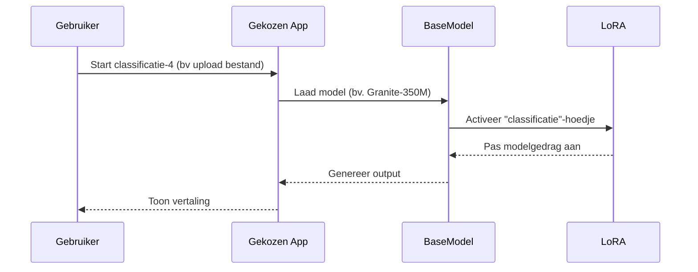
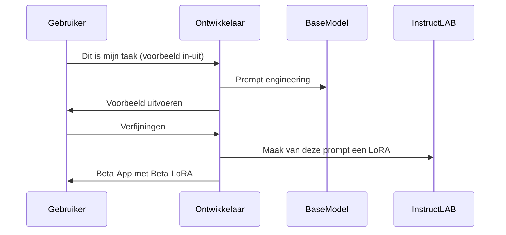
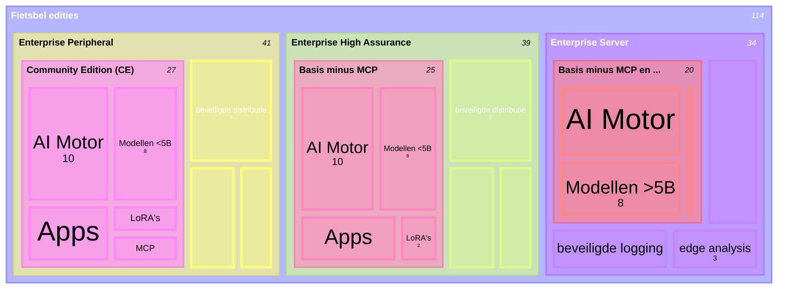
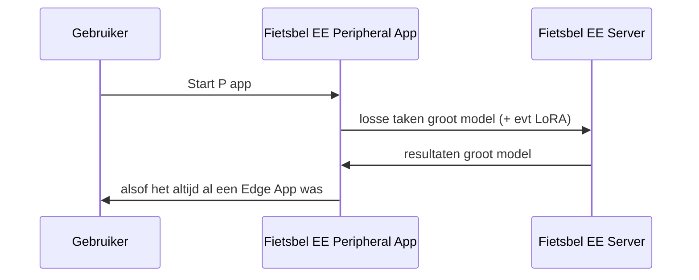

# Fietsbel: een veilig en voordelig AI platform voor de overheid
## introductie
### ❓probleemstelling
(Generatieve) AI is een grote hype en schept hoge verwachtingen. Vrijwel iedereen heeft het uitgeprobeerd en velen vragen zich af: "kan de overheid hier dingen mee verbeteren?". Die vraag willen we goed aanpakken. We willen ideeën onderzoeken en checken of ze echt dingen beter maken. We denken dat er ook veel ideeën zullen zijn die de dingen niet beter maken. Bijvoorbeeld omdat ze een ander iemand meer werk opleveren, of omdat ze zorgen dat iemand geen ervaring meer opdoet.
En we moeten het goede voorbeeld geven in hoe we aan alle wetten voldoen. En die wetten zijn nogal ingewikkeld en soms nog niet helemaal af.
Tot slot is niets gratis. Niet onze tijd, niet de dingen die we inkopen. We zijn verplicht om verstandig om te gaan met het geld van de belastingbetalers.
### ❗Oplossingsrichting
Fietsbel is voor en door de overheid bedacht, om veel problemen van tevoren op te lossen:
* Fietsbel is gratis (free and open source software).
* Fietsbel draait op de computers die we al hebben.
* Fietsbel is vanaf de bodem wettig gebouwd.
* Fietsbel is zo veilig als het maar kan.
* Fietsbel maakt slim onderzoek makkelijk.
#### 🔓Gratis (Open Source)
Wij maken Fietsbel met onderdelen die er al waren, die al gratis zijn. Het valt eigenlijk wel mee hoe veel werk het nog is om die onderdelen aan elkaar te knopen. Dit kon "erbij" gedaan worden door maar een paar mensen.
Dat het "open source" is, betekent ook dat iedereen precies kan zien hoe het werkt. Iedereen die het interessant vindt, kan ernaar kijken, vragen stellen en zelf verbeteringen bedenken. Dan is het niet meer "een paar mensen die het erbij doet" is, maar de hele wereld. En dat maakt het veiliger, omdat fouten eerder ontdekt worden.
Iedereen kan en mag Fietsbel downloaden en zelf gebruiken en uitproberen. Er hoeft niet voor betaald te worden. Als je er meer mee wil, moet je je wel aan de regels houden: de EUPL licentie.
#### 💻Bestaande computers
Generatieve AI kan heel veel rekenkracht vragen. En veel mensen die generatieve AI maken, denken "groter is beter". Fietsbel doet het anders: "wat is precies groot genoeg?". Want als het te groot wordt, past het niet meer op een gewone computer. Fietsbel draait het om: "wat kan er wel op een gewone computer?" en wat blijkt: heel veel! En gewone computers worden steeds krachtiger. En AI software wordt steeds beter. We kunnen nu alvast beginnen en weten dat het alleen maar beter zal worden.
Gewone computers hebben we al en alles wat ervoor nodig is, bestaat al. Voor Fietsbel hoeven we geen duurdere of grotere computers te kopen of te huren. We hebben geen nieuwe beheer-specialisten nodig. Geen nieuwe regels, loketten, leveranciers. Wel is er nieuwe expertise nodig om de LoRA te maken en bij te houden. De Apps kunnen ontwikkeld worden binnen bestaande kennis en vaardigheden door teams die nu met nadere RAD of low-code  taakgerichte Apps maken.
Ja, Fietsbel gebruikt een beetje extra stroom op onze bestaande computers. Maar dat is zo weinig, voor 2.000 gebruikers is dat ongeveer hetzelfde als één huishouden. ChatGPT verbruikt makkelijk 100 keer meer.
Om echt te laten zien wat er mogelijk is op bestaande computers, kiezen we ervoor om twee generatieve AI motoren te gebruiken: één heel bekende en degelijke en de ander heel snel en super modern. Generatieve AI op bestaande computers zal minder snel zijn dan op super computers. Voor een hoop dingen hoeft dat ook niet. Maar we doen er wel alles aan, om het zo snel te maken als het kan.
#### ⚖️Wettig vanaf de bodem
We hebben elke wet die met AI en computers te maken heeft bekeken. Het zijn er bijna 20. Fietsbel maakt het makkelijk om aan alles te voldoen, zo makkelijk als het kan. Omdat we eerst zijn gaan denken aan de wet en dan pas aan de techniek. Het is lastig om dit in makkelijke taal uit te leggen. Maar we stellen de wereld de vraag: "Hier is hoe het werkt, wij denken dat we alles goed hebben gedaan. Kunnen jullie ons werk controleren?". Dat is een uitdaging voor elke jurist en techneut. We rekenen erop dat "ons best" een goed begin is en dat het nog beter kan. En zodra dat er is, gaan we dat doen.
#### 🛡️Zo veilig als het maar kan
Fietsbel is bijzonder. De gegevens die je gebruikt met de AI blijven op je eigen computer en de AI komt naar jou toe. Dit noemen we: "Model naar de Data brengen". Dus niemand krijgt zomaar jouw gegevens. Dan maken we het ook zo, dat we helemaal zeker weten dat alle onderdelen van Fietsbel echt zijn en goed werken. De kern van Fietsbel is eigenlijk heel eenvoudig. Die zetten we op internet als de "Community Edition". Die is dus voor iedereen om uit te proberen hoe de generatieve AI werkt. Maar de "Enterprise editions" (daar komen er drie van: hoog beveiligd, persoonlijk en server), die bevatten een hele toestand eromheen om deze veiligheid met techniek te versterken.
#### 🔬Slim onderzoeken is snel zeker weten
"Snel" en "zeker" gaan wat lastig samen. Met Fietsbel zorgen we dat we zo snel als het kan, zo zeker als het kan zullen weten of een idee met generatieve AI dingen beter maakt. Dit doen we door het makkelijk te maken om zelf te verkennen en ideeën te maken. Dan maken we het zeker door verstandige vragen te stellen en met verschillende deskundigen de ideeën te onderzoeken. Die "verstandige vragen" zullen we vaak veranderen, wanner we zelf meer leren over werken met generatieve AI. Zo maken we een lijst van dingen die we zeker wel en zeker niet moeten gaan doen. En we blijven werken aan die lijst. De dingen die we gaan doen, brengen we ook naar buiten als gratis Open Source software. Dat worden Fietsbel Apps. Die kan iedereen gebruiken, veranderen en verbeteren. Daar heeft iedereen dan weer profijt van.
## Baten voor de samenleving
### 💡Effectievere overheid
Met Fietsbel kan de overheid heel veel kleine dingen uitproberen. Zonder fietsbel zullen dat er maar een paar heel grote en dure zijn. En juist omdat ze groot en duur zijn, mogen ze niet mislukken. Ook als blijkt dat het toch niet zo'n goed idee was. Fietsbel maakt het goedkoop om dingen te proberen en *niet* te doen. Daarom zullen we ook meer dingen ontdekken die we *wel* moeten doen.
### 🪙Kostenbesparing
Fietsbel zelf is gratis en open source en de computers en stroom die we verbruiken, verbruikten we al. Er zijn geen nieuwe deskundigen nodig. Degenen die al kleine programma's maakten, kunnen dat nu met generatieve AI doen. Er zullen veel direct herbruikbare Apps en LoRa (zie verder onder technische onderdelen) beschikbaar komen. De documentatie, training en verbetering zullen gezamenlijk gedaan worden. Dit in tegenstelling tot de ongeveer 40 zelf gebouwde chatbots die al publiek zichtbaar zijn bij de Nederlandse overheid, of de zeker meer dan 20 tekstvereenvoudigers die minder zichtbaar zijn.
### 💚Milieuoverwegingen
Fietsbel is de zuinigste manier om generatieve AI te gebruiken. Aan de ene kant doordat het zo min mogelijk stroom verbruikt voor zo veel mogelijk nut. Aan de andere kant doordat er geen nieuwe supercomputers, data centra of AI-fabrieken hoeven te worden gebouwd. Een besparing van meer dan 99% ten opzichte van vrijwel elk ander AI initiatief.
### 👑Autonomie
Fietsbel maakt ons onafhankelijk. Het is gemaakt van Open Source onderdelen en elk onderdeel kan vervangen worden. Je kunt vandaag alles downloaden en tot het einde der tijden gebruiken. Je beslist zelf over elk onderdeel en kunt ook als eindgebruiker de werking controleren en veranderen met dezelfde vaardigheden waarmee je een website maakt.
### 🦉Voorbeeldfunctie
Fietsbel is bedoeld als positief voorbeeld van hoe de wet kan leiden tot positieve effecten voor iedereen. Trots in plaats van angst. Dit is hoe we laten zien dat vooraf reguleren wél tot innovatie kan leiden. Dit is hoe we het [Draghi rapport](https://commission.europa.eu/topics/competitiveness/draghi-report_en) handen en voeten geven. Dit is de [Eurostack](https://eurostack.eu/) in onze eigen achtertuin.
Fietsbel helpt Europa minder een speelbal van anderen te laten zijn.
## Alternatieven
Iets dat helemaal nieuw is en echt nog nooit door iemand gedaan, dat bestaat haast niet meer. Fietsbel zelf is opgebouwd uit bestaande delen. Als geheel, bestaat het nog niet. Twee voorbeelden komen er dicht bij:
* [Liquid AI](https://www.liquid.ai/) is een Amerikaans AI platform voor op je bestaande computers. Maar het maakt gebruik van speciale modellen en is niet gericht op voldoen aan de EU AI act en veroorzaakt afhankelijkheid van één leverancier: Vendor lock-in. Dit is het tegenovergestelde van autonomie.
* [Microsoft Foundry Local](https://www.foundrylocal.ai/). Heeft exact dezelfde nadelen als Liquid, maar dan met Microsoft.
## Technische Onderdelen
### 🔥Generatieve AI "motor"
De basis voor Fietsbel zijn twee aparte generatieve AI motoren. Alletwee zijn Open Source
* **[Llama.cpp](https://github.com/ggml-org/llama.cpp)** Deze kan heel veel en wordt veel gebruikt.
* **[Bitnet.cpp](https://github.com/microsoft/BitNet)** Deze is heel snel, maar heeft minder extra's. We hopen dat in de toekosmt Llama.cpp ook net zo snel wordt als Bitnet.cpp. Maar ondertussen willen we dit wel al laten zien: dit geeft vandaag de maximale snelheid, die misschien morgen de normale snelheid wordt. BitNet.cpp is heel snel omdat het een speciale rekentruc gebruikt (ternaire modellen), maar heeft minder extra functies. Wij hopen dat binnenkort die zelfde snelheid ook in Llama.cpp zit. Maar we willen nu alles eruit halen, wat erin zit.
### 🛢️Generatieve AI "brandstof"
Je bent wat je eet. En dat geldt ook voor taalmodellen: dat is de soort generatieve AI die in Fietsbel zit. Daarom kiezen we voor taalmodellen die alleen maar gezond hebben gegeten: geen persoonsgegevens, geen gestolen boeken, geen onzin en geen haat. Jammer genoeg zijn de meeste modellen die je kent wel gevoed met slechte dingen. Als je het echt zuiver wil houden, blijven er maar een paar over: [Granite 4 van IBM](https://www.ibm.com/granite), [Olmo van AllenAI](https://allenai.org/olmo) en [Apertus van SwissAI](https://www.swiss-ai.org/apertus). Als je nu zegt: "maar [GPT-NL](https://gpt-nl.nl/) dan? die doen toch ook alles goed?" Dat klopt, maar de eerste versie GPT-NL wordt te groot voor Fietsbel.
Uiteindelijk mag iedereen zelf weten welke "brandstof" ze in hun Fietsbel gooien. Maar wij kiezen voor de eerste versie voor:
* [IBM Granite docling 258M](https://huggingface.co/ibm-granite/granite-docling-258M)
* [IBM Granite 4 350M](https://huggingface.co/ibm-granite/granite-4.0-350m)
* [IBM Granite 4 1B](https://huggingface.co/ibm-granite/granite-4.0-1b)
* [Microsoft Bitnet 2B](https://huggingface.co/microsoft/bitnet-b1.58-2B-4T-gguf)
* [IBM Granite 4 3B](https://huggingface.co/ibm-granite/granite-4.0-micro)
* [IBM Granite 32B](https://huggingface.co/ibm-granite/granite-4.0-h-small)
* [Olmo 3 32B](https://huggingface.co/allenai/Olmo-3-32B-Think)
* [Apertus 70B](https://huggingface.co/swiss-ai/Apertus-70B-Instruct-2509)

Misschien zie je al iets opvallends. Die "B" getallen staan voor het Engelse "billion", in het Nederlands "miljard". Niet te verwarren met "Biljoen". Engels en Nederlands gebruiken bijna dezelfde woorden voor verschillende getallen, dus houden we het even bij Engels. Wat wij vandaag op Fietsbel kunnen gebruiken, houdt ongeveer op bij 5B. Dus 32B en 70B zijn veel te groot. Die gebruiken we bij het maken van de "boosters".
We kiezen bewust voor kleinere modellen die je beter begrijpt en kunt controleren.
### 🚀Generatieve AI "Boosters"
Hoe kleiner een taalmodel, in "B", hoe minder het kan nadenken, hoe minder het weet en hoe minder het kan. Toch kunnen we kleine taalmodellen heel makkelijk meer kennis en vaardigheden geven. Door ze een "hoedje" op te doen. Misschien ken je het wel, een toneelstuk waarbij één acteur veel rollen moet spelen? Als één acteur een politiepet opzet, is die de agent. Een mijter? Sinterklaas. Een zonnebril? Een koele guy. Zoiets kunnen we ook doen met taalmodellen. Deze hoedjes maken we met de grotere modellen (32B en 70B) en die kan het kleine model (kleiner dan 5B) heel snel op en afzetten. Zo snel, dat die met zichzelf een gesprek kan voeren. 
Zodra we precies weten wat iemand gedaan wil krijgen van het taalmodel, kunnen we met de "hoedjesfabriek" een hoedje maken. Daar hebben we dan wel een sterker dan gewone computer voor nodig, maar nog geen super computer in een aparte bunker. Deze hoedjes heten Low Rank Adapter (of LoRa). De fabriek is [InstructLAB](https://github.com/instructlab). Deze fabriek maakt het makkelijk om bij te houden welk hoedje wat doet en hoe het gemaakt is. We gebruiken géén nieuwe gegevens om de hoedjes te maken. We ontdekken hoe het kleine model moet werken door heel precies te vertellen wat het moet doen. Dat voeren we dan in in de fabriek. Die maakt de gegevens die nodig zijn. De hoedjes (de LoRa adapters) maken we ook gratis en Open Source. Die horen namelijk bij de Fietsbel Apps.
In de Community Edition kun je de LoRa direct gebruiken, in de Enterprise editions zorgen we dat ze gegarandeerd van de enige echte bron afkomstig zijn en onderweg niet zijn aangepast.
### 🛍️Generatieve AI "Apps"
Met een motor kun je van alles laten werken: een auto, vliegtuig, boot, polder-gemaal, draaimolen, toetjesfabriek. Zo ook met de Generatieve AI Apps. Het idee van Fietsbel is, dat elke app op zich staat. We gaan niet proberen om met dezelfde motor een draaimolen-boot te maken. Elke app doet precies één ding en doet dat zo goed als het kan. Als het nodig is, met een "booster", in de vorm van een LoRa adapter ("hoedje").
Deze apps maken we ook gratis en Open Source. Op de Community Edition van Fietsbel kun je die gewoon zelf aanklikken en inladen. In de Enterprise Editions, zorgen we dat ze gegarandeerd van de enige echte bron afkomstig zijn en onderweg niet zijn aangepast.
De apps zijn telkens helemaal zelfstandig. Behalve de motor, brandstof en boosters, heb je er niets anders bij nodig dan een moderne webbrowser. Elke app is één HTML bestand, dat steeds alles in zich heeft om te kunnen werken. Soms zijn dat onderdelen die andere mensen gemaakt hebben. Meestal zet je die dingen niet in je eigen HTML bestaand, maar haal je de laatste versie op van internet. Maar wij willen dat Fietsbel ook zonder internetverbinding kan werken. Daarom geven we heel duidelijk aan welke onderdelen en welke versie precies we hebben gebruikt van andere Open Source software en nemen we ze op ín onze Apps. Dit heet "Vendoring" en moet heel precies en zorgvuldig gedaan worden. Maar de winst is dat Fietsbel compleet zonder netwerkverbinding ("Air Gapped" heet dit ook wel) gebruikt kan worden. Bijvoorbeeld wanneer je echt heel erg zeker wil weten dat er niets van je computer kan weglekken.
### 🛠️Generatieve AI "Tools"
Als je weet dat eigenlijk het enige dat generatieve AI kan, is dat het het volgende woord voorspelt, dan zul je snappen waarom het niet het aantal keer dat de letter R voorkomt in het woord Strawberry kan tellen. En niet kan rekenen, ook al is het een computerprogramma. En zelf geen verbinding kan maken met andere computers. Daar heeft het gereedschappen voor nodig, "Tools". Fietsbel maakt dit mogelijk op een veilige manier, namelijk in de webbrowser. Die is zelf al redelijk goed beveiligd en kan toch heel veel, als je er bewust toestemming to geeft. De tools worden gemaakt in JavaScript en draaien in de App. Elke App kan z'n eigen tools hebben. Dat kan een letter-teller zijn, een rekenprogramma, routeplanner, of iets dat een zoekactie doet op internet, of iets dat een machine uitleest. De manier waarop dit werkt heet MCP, Model Context Protocol.
### 👥 Generatieve AI "multidisciplinair overleg" of Agentic
Sommige taken vragen om de kennis en kunde van meer dan één model. Daarom maakt Fietsbel het mogelijk dat modellen samenwerken om een taak te doen. Dit wordt ook wel "Agentic AI" genoemd. Eigenlijk zal dat heel vaak hetzelfde model zijn, dat steeds heel snel verschillende "boosters", LoRa of "hoedjes" wisselt. Omdat elke App één ding doet, is het ook telkens één soort multidisciplinair overleg. De agenda voor dat overleg staat al van tevoren vast. "Deterministisch" noemen we dit. En dat is een goede zaak, want dan weten we zo zeker mogelijk hoe het precies werkt en kunnen we later uitleggen hoe dingen zijn gemaakt.
## Functionele
### 📚Edities (CE, EE: HA, P, S)
* 👫CE (Community Edition). Zo laag mogelijke drempel om kennis te maken met Fietsbel en alle applicaties (inclusief LoRa) te kunnen gebruiken. 
* 👮EE HA (Enterprise Edition High Assurance). Zo veilig mogelijke versie, die  gericht is op één keer installeren, dan nooit meer online. Bepaalde functionaliteit is uitgeschakeld. Gebouwd om via een distributiesysteem te worden beheerd. Omvat een beheerssysteem voor de Apps.
* 🌐EE P (Enterprise Edition Peripheral). De complete versie van Fietsbel, voor de meeste Enterprise gebruikers. Bevat ook faciliteiten om gerichte online functies te doen en deel te nemen aan Beta programma's. Gebouwd om via een distributiesysteem te worden beheerd. Omvat een beheerssysteem voor de Apps.
* 🛜EE S (Enterprise Edition Server). De andere drie versies van Fietsbel werken alleen op je eigen computer en zijn zo ontworpen, dat je er van buitenaf niet bij kunt. Maar als je taalmodellen wil gebruiken die groter zijn dan 5B, dan heb je een extra sterke computer nodig. De S editie maakt dit mogelijk, doordat je wél van buitenaf bij de Fietsbel op één extra sterke computer kunt. Dat betekent dan wel (in de eerste versie), dat de netwerkfuncties buiten Fietsbel beperkt zijn tot dingen waar je niet op hoeft in te loggen.
### 🚧Guardrails
Dit is het Engelse woord voor wat in Nederland officieel "geleiderails" heet, in de volksmond ook wel "vangrails". In het echt helpen ze je zacht tegen te houden als je van de weg af zou gaan, of in ieder geval zachter dan een betonnen muur. Bij AI systemen werkt het net zo: eerst probeer je te voorkomen dat je van de weg raakt, maar als het toch gebeurt houd je het hard tegen. Fietsbel Apps en techniek werken samen om te voorkomen dat je "van het padje" raakt. Niet elke App heeft deze guardrails nodig: sommigen hebben niet genoeg vrijheid om fout te gaan. Maar waar dat wel kan, passen we heel precies gekozen methoden toe, om zo veel mogelijk effect te hebben en zo min mogelijk dwars te zitten.
#### Ingebouwd
"Ingebouwd" wil zeggen dat het functies zijn die al ergens in de bestaande software zitten. Die hoef je alleen maar "aan" te zetten, of correct in te stellen.
* **Grammar**. Llama.cpp heeft een functie waarmee je een sjabloon kunt toevoegen aan een model. Dit zegt dan: je mag alleen maar volgens het sjabloon antwoorden. Bijvoorbeeld als je vraagt of het lekker weer is morgen, kun je een sjabloon maken dat alleen "ja" of "nee" toestaat. Geen enkele kans op onwenselijke antwoorden. Deze sjablonen kun je per vraag veranderen, dus ook bij Agentic toepassingen kan elke agent een eigen sjabloon gebruiken.
* **Logit Bias**. Llama.cpp heeft een functie waarmee je woord voor woord scores kunt geven om die meer of minder te gebruiken. Voor Apps waarbij vrije tekst uitkomt en blijkt dat er onwenselijke termen worden gebruikt, kun je die per stuk naar beneden aanpassen. Als je de score voor zo'n woord aanpast, is het ook zo dat het model extra moeite doet om de zin nog kloppend te maken, dus het veranderen van de score van één woord kan heel andere zinnen geven. Deze scores kun je per vraag aangeven, dus voor elke agent kan het anders zijn.
* **Mirostat**. Llama.cpp heeft een functie die automatisch bijstuurt hoe creatief een model antwoordt. Het kan creativiteit omlaag brengen, als er minder zekerheid is. Dit helpt hallucineren (ofwel: bij elkaar verzinnen) verminderen. Deze instellingen kun je per vraag aangeven, dus voor elke agent kan het anders zijn.
#### Aangebouwd
"Aangebouwd" wil zeggen dat je dingen moet toevoegen om de functies die je wil ook te krijgen. Fietsbel gebruikt een klein taalmodel (Granite 4 350M) waar het nodig is om bovenop de ingebouwde functies nog extra zekerheid in te bouwen. IBM Granite van de vorige versie had exemplaren die speciaal getraind waren om bepaalde vormen van misbruik bij invoer en uitvoer te onderdrukken ([voorbeeld 1](https://www.ibm.com/granite/docs/use-cases/risk-detection), [voorbeeld 2](https://www.ibm.com/granite/docs/use-cases/hap-detection)). Voor apps die dit nodig hebben, kunnen we dit eerst met het standaard Granite 4 350M model proberen op te vangen. Als dat onvoldoende werkt, kunnen we een LoRa trainen om preciezer te zijn.
We kunnen in twee stappen werken: zien wanneer het lijkt op te treden en een waarschuwing geven, of wanneer het optreedt de App stoppen, totdat de gebruiker de bediening heeft aangepast. Ook kunnen we in beide gevallen opslaan en doorgeven hoe het zo ver heeft kunnen komen. Dit blijft op de eigen computer en wordt dus niet verstuurd. Echt diep onderzoek moet dan ook op die computer zelf plaatsvinden, die eerst door de gebruiker moet worden ontgrendeld.
### 🖱️Gebruikers-interface
De Apps maken gebruik van de webbrowser. Alle mogelijkheden die een webbrowser heeft voor verhogen van toegankelijkheid, kunnen ook voor Fietsbel Apps worden ingezet. Webbrowsers zijn één van de meest gebruikte soorten programma's. We verwachten dat voor alle Enterprise medewerkers voldoende werkbare Apps gemaakt kunnen worden. Juist één van de kansen van generatieve AI is het verhogen van toegankelijkheid en participatie. Mochten er mogelijkheden voor verbetering zijn, dan zullen wij die aangrijpen.
## Functionele onderdelen Enterprise Editions
De CE kan dezelfde Apps draaien als EE, maar EE zorgt ervoor dat je heel zeker weet dat alles precies is zoals het zijn moet.
### Superveilig (zero trust)
Hoe maak je dingen zo veilig als ze kunnen zijn? Door te doen alsof iedereen, op elke plek, een boef kan zijn. Vertrouw niemand (zero trust). Dat kost wat werk en daarom zit er veel meer software in de EE dan in de CE. En dit kan ook nog steeds als je alle onderdelen open en bloot op internet zet, voor iedereen om te gebruiken (Free and Open Source Softare, FOSS). Je zet hoe het werkt open, maar de geheimen die je gebruikt niet. Dit helpt op twee manieren: als er toch een vergissing in zit, kun je makkelijk samenwerken om die sneller te vinden dan je in je eentje zou kunnen. En als echte boeven weten hoe hard ze zullen moeten werken om jouw systeem te kraken, proberen ze het misschien niet eens. 
### Onbewoond eiland-AI (airgapped local binding)
Fietsbel luistert voor AI alleen naar je eigen computer (localhost), nooit naar het netwerk. Je kunt op elk moment de netwerkverbinding verbreken en doorwerken. Als je weer verbinding maakt, gaat alles vanzelf weer verder (multi-master replication).
Ook de Apps bevatten alle onderdelen die nodig zijn en gaan nooit dingen op internet halen. Dit heet 'vendoring'.
### Software distributie
In een groot bedrijf (een "enterprise") kun je niet zomaar zelf software installeren. Alleen door het bedrijf goedgekeurde software komt vanzelf op jouw werklaptop. Dit gebeurt via een distributie-systeem, ook wel Mobile Device Manager (MDM) genoemd, zoals Ivanti workplace manager. Op één plek controleren we welke versie moet worden uitgedeeld. Op de werklaptop kun je daar niets meer aan veranderen. Voor Fietsbel zijn dit de stukken software die de modellen draaien (de motor), de modellen zelf (de brandstof) en een paar kleinere stukken software die EE dingen doen (zie verderop in dit hoofdstuk). We behandelen AI-modellen als programma's, niet als gegevens. Dit betekent dat ze via hetzelfde veilige systeem worden uitgedeeld als andere software.
### Vaste laag (immutable layer)
Wat niet zo vaak veranderd hoeft te worden, gaat via de software distributie. Die dingen zijn "vast" en kan je op je werklaptop niet veranderen.
### Veranderbare laag (mutable layer)
Wat vaker veranderd moet worden, gaat via een ander systeem. Eigenlijk lijkt dat ook op een software distributie systeem, maar het is twee richting verkeer. Dit zijn de apps (de brandstof) met de Tools, de LoRA (boosters of feesthoedjes) en logs (die vertellen hoe het systeem gewerkt heeft).
### Onderzoek op de machine
Er zijn twee dingen die je wil, in een Enterprise:
* weten hoe het systeem, de losse apps, de modellen, maar ook de gebruiker aan de slag gaan. Om te kijken of alles nog werkt zoals het moet, of er dingen veranderd moeten worden of er misschien nieuwe training nodig is.
* alleen gegevens opslaan die echt per sé nodig zijn en dan nog zo, dat niemand zich bekeken kan voelen of dat het gebruikt kan worden om iemand te bekijken.
Die twee dingen bijten elkaar. Je hebt alle gegevens nodig om te onderzoeken of alles goed werkt en of er dingen veranderd moeten worden, terwijl je juist die gegevens niet wil opslaan. De oplossing: onderzoek op de machine.
Fietsbel doet het onderzoek zelf, op de machine en stuurt alleen de resultaten naar buiten. De manier waarop het onderzoek werkt, kunnen we op afstand veranderen. We proberen het eerst uit, om zeker te weten dat we echt alleen de resultaten eruit halen en dat het onderzoek ook echt werkt voor iedereen. Het is belangrijk om dit goed te blijven doen, dus is het voor iedereen duidelijk hoe precies het onderzoek werkt.
Tussentijdse controles worden alleen in het werkgeheugen opgeslagen en verdwijnen vanzelf. Er staat nooit iets op de harde schijf.
Het lijkt heel veel werk, maar het is echt nodig. De wet zegt dat we moeten zorgen dat de AI goed blijft werken en dat de mensen die met AI werken het ook op de goede manier gebruiken.
### Driedelige verbinding (tri-state database)
Fietsbel kan werken zonder netwerkverbinding (airgapped). Op een onbewoond eiland, of een heel beveiligde kamer. Dat hoef je niet in te stellen, zet gewoon de verbinding uit, of trek de stekker eruit. Maar toch willen we dat het ook mogelijk is om: 
* Apps en LoRA te downloaden
* resultaten van onderzoek teruggeven
* samenwerken voor nieuwe Apps en LoRA
En dit willen we heel precies sturen. Daarom hebben we drie programma's (databases), die elk maar één ding kunnen en alleen die gegevens voor iedere Fietsbel gebruiker verzamelen. Door drie gescheiden databases kunnen verschillende dingen niet elkaar stuk maken: als Schrijven volloopt, werkt Lezen gewoon door.
* Alleen lezen (uitdelen van Apps en LoRA)
* Alleen schrijven (innemen van logs)
* Lezen en Schrijven (voor samenwerken met App-makers (ontwikkelaars) aan nieuwe apps)
Als een nieuwe App klaar is, komt er iemand kijken en die geeft dan toestemming om de app en LoRA voor iedereen uit te delen. Dan gaan die van de lezen+schrijven naar de alleen-lezen database.
### 🃏Beta vs Productie
De Fietsbel Apps die klaar zijn voor breed gebruik, zijn voor iedereen beschikbaar. Apps die nog in ontwikkeling zijn, met LoRa die nog getest moeten worden, gebruik je op een andere manier en dat is heel duidelijk. Zo weet je altijd dat je Fietsbel App in betrouwbaar is. Om een heel goede App te maken, heeft een App-maker alle informatie nodig. Daarom kan die heel precies zien hoe de App gebruikt wordt.  
Zolang de App-maker nog niet klaar is, mag je nog geen echt werk doen met de App. Zo weten we zeker dat er niemand last heeft van wat we met de half-affe App doen. Om te kijken of de half-affe App wel goed kan werken in het echt, hebben we nep-gegevens om mee te werken. Die maken we zo, dat ze net lijken op de echte gegevens.
Elke App die nog niet klaar is, kun je maar 30 dagen gebruiken. Daarna vernietigt die zichzelf.
### Verzekerde post (encryption & verification)
De Apps en LoRA zijn heel belangrijk. Als iemand ze kan veranderen tussen de database en jouw werklaptop, dan kan het zijn dat er heel verkeerde dingen gebeuren. Daarom pakken we de Apps in en doen we er een digitaal slotje op. Een apart programma (native verifier) controleert de slotjes (signatures, encryptie) buiten de webbrowser om, voor extra zekerheid. Alleen jij kunt dat slotje openen op je werklaptop. Dit geldt ook voor de logs, die je schrijft. We zorgen ervoor dat er niemand tussendoor kan kijken of iets kan veranderen, voor elk onderdeel dat heen-en-weer gaat.
### Alles nog in orde? (heartbeat)
En zelfs als het al op je werklaptop staat, wil je zeker weten dat er niets veranderd is. Misschien was je even weg en heeft iemand iets met jouw laptop gedaan. Zelfs het geheugen in je werklaptop moet je eigenlijk niet vertrouwen. Daarom controleren we automatisch en zonder dat je het merkt, of alles nog wel klopt. Ook als het al op je laptop staat. En om zeker te weten dat dát systeem nog werkt, stuurt Fietsbel af en toe een signaal. Als een hartslag. En als dat signaal stopt, gaat het alarm af en stopt Fietsbel. Dit werkt ook zonder netwerkverbinding.
De hartslag draait los van de rest, zodat die ook werkt als Fietsbel vastloopt.
## Enterprise Edities: Verschillen tussen P, HA en S

### 📱 Periphery (P) - Standaard Editie

**Voor wie**: De meeste organisatiemedewerkers

**Wat kan het**:
- AI-toepassingen voor dagelijks werk
- Vertrouwelijke bedrijfsinformatie
- Tot DEPARTEMENTAAL VERTROUWELIJK
- Workflow-ondersteuning (taken automatisch na elkaar)
- LoRAs wisselen tijdens het werk
- Beta-modus voor nieuwe Apps testen

**Netwerk**:
- Kan verbinding maken met centrale servers (voor updates)
- Kan Beta-Apps downloaden
- Stuurt metadata terug (geen inhoud!)

**Voorbeeld gebruik**:
- Samenvattingen maken van rapporten
- Vertalingen van documenten
- Controle van facturen
- Zoeken in kennisbank

**Beperkingen**:
- Maximaal 4 miljard parameters modellen
- Geen staatsgeheimen

### 🔒 High Assurance (HA) - Hoog Beveiligde Editie

**Voor wie**: Medewerkers met staatsgeheimen of zeer gevoelige persoonsgegevens

**Verschil met P**:

#### ❌ NIET mogelijk in HA:
- Achtergrondtaken (alles moet je zelf starten)
- Workflow-automatisering (geen "doe automatisch B na A")
- Opslaan van tussenresultaten (alles in geheugen, verdwijnt daarna)
- Beta-modus (alleen goedgekeurde Apps)
- Netwerkverbinding (volledig afgesloten)

#### ✅ WEL mogelijk in HA:
- Alle P-functies die niet hierboven staan
- Één taak tegelijk
- Extra strenge controle op wat er opgeslagen wordt
- Werk met staatsgeheim materiaal
- Werk met persoonsgegevens (als daar doebinding voor is)

#### 🔐 Extra beveiligingen:
- Volledig air-gapped (geen netwerk)
- Geen enkele persistentie (alles verdwijnt na afsluiten)
- Alleen vooraf goedgekeurde Apps
- Geen metadata naar buiten (ook geen logs)
- Hardwarematige scheiding (aparte computer of herstart vereist)

**Voorbeeld gebruik**:
- Inlichtingendiensten (staatsgeheimen)
- Rechtbanken (strafrechtelijke dossiers)
- Ziekenhuizen (medische dossiers)
- Ministeries (vertrouwelijke beleidsstukken)

**Belangrijke regel**: HA kan NOOIT op dezelfde computer als P. Bij installatie ligt de keuze vast, totdat opnieuw geïnstalleerd wordt.

### 🖥️ Server (S) - Gedeelde Editie

**Voor wie**: Teams die grotere modellen nodig hebben of geen eigen krachtige laptop hebben

**Verschil met P**:

#### Waar het draait:
- Niet op je eigen werklaptop
- Op een sterke server binnen je eigen organisatie
- Meerdere mensen kunnen tegelijk gebruiken

#### Wat het kan:
- Grotere modellen (meer dan 4 miljard parameters)
- Snellere verwerking (met GPU)
- Meer mensen tegelijk helpen
- Zwaardere taken (lange documenten, complexe analyses)

#### Beveiligingsverschil:
- In P: alles op je eigen computer, niemand kan erbij
- In S: server binnen je organisatie, alleen collega's kunnen erbij
- NIET voor staatsgeheimen! (gebruik dan HA)

#### Beperkingen (in eerste versie):
- Alleen voor systemen zonder inloggen (bijv. interne zoekfunctie)
- Geen verbinding met externe websites
- Alleen binnen organisatienetwerk

**Voorbeeld gebruik**:
- Hele afdeling gebruikt dezelfde kennisbank-zoekfunctie
- Verwerken van grote hoeveelheden documenten
- Gedeelde vertaalservice
- Analyse van grote datasets

---

### 🔄 Samenvatting Verschillen

| Aspect | P (Periphery) | HA (High Assurance) | S (Server) |
|--------|---------------|---------------------|------------|
| **Locatie** | Je eigen laptop | Je eigen laptop (of afgesloten) | Organisatieserver |
| **Max classificatie** | Departementaal Vertrouwelijk | Staatsgeheim | Departementaal Vertrouwelijk |
| **Netwerk** | Ja (updates) | Nee (air-gapped) | Ja (intern) |
| **Persistentie** | Beperkt | Geen | Beperkt |
| **Workflows** | Ja | Nee | Ja |
| **Beta-modus** | Ja | Nee | Nee |
| **Meerdere gebruikers** | Nee (eigen laptop) | Nee (eigen laptop) | Ja (gedeeld) |
| **Modelgrootte** | Tot 4B | Tot 4B | hardwaregrens |
| **Gebruik voor** | Dagelijks werk | Staatsgeheimen / Privacygevoelig | Zware taken / Gedeeld |

---

### 🚦 Wanneer welke editie?

#### Kies P als:
- ✅ Je met normale bedrijfsgegevens werkt
- ✅ Je nieuwe Apps wilt testen
- ✅ Je workflows wilt automatiseren
- ✅ Updates belangrijk zijn

#### Kies HA als:
- ✅ Je met staatsgeheimen werkt
- ✅ Absolute zekerheid nodig is
- ✅ Netwerk NIET mag
- ✅ Je persoonsgegevens verwerkt die extra beschermd moeten worden

#### Kies S als:
- ✅ Je grotere modellen nodig hebt
- ✅ Je laptop niet krachtig genoeg is
- ✅ Hele team dezelfde functie gebruikt
- ✅ Zware documenten verwerkt moeten worden

**Let op**: P en HA kunnen niet samen. S kan naast P (op verschillende computers).

## ⁉️Vraag en Antwoord

### Algemeen

#### Kan Fietsbel alles wat ChatGPT ook kan?
Nee, niet op de eigen bestaande computers. ChatGPT draait op supercomputers met enorme hoeveelheden rekenkracht. Fietsbel is juist gemaakt voor gewone computers. Dat betekent dat de modellen kleiner zijn en sommige complexe taken niet kunnen. Maar voor heel veel dagelijkse taken (zoals teksten samenvatten, vertalen, controleren) werkt het prima. En het wordt alleen maar beter: computers worden krachtiger en modellen worden slimmer.

#### Is Fietsbel gratis?
Ja en nee. De software zelf is gratis en open source. Iedereen mag het downloaden en gebruiken. Maar je hebt wel een computer nodig om het op te draaien. Voor organisaties komt daar ook de tijd bij van mensen die het installeren en beheren. Dus het is gratis zoals een fiets gratis (zodra je die eenmaal hebt): je betaalt niet per kilometer, maar je hebt wel een fiets nodig.

#### Waar komt de naam Fietsbel vandaan?
Een fiets is een proportioneel vervoermiddel, maar je kunt er toch een minister-president mee vervoeren. Om de dagelijkse boodschappen te doen, kun je beter een fiets nemen, dan een zware pickup.
Een fietsbel maakt fietsen veiliger en iedereen weet hoe je het moet gebruiken. Als je een beetje nieuwsgierig bent, maak je er een open en je ziet hoe het werkt. Het is niet bijzonder, of high-tech. Al zijn de onderdelen zelf misschien wel het resultaat van heel verfijnde industriële optimalisatie.
In een wereld van milieuverontreinigende, tonnen wegende pickups, is een fiets misschien niet het snelst, maar het is gratis, schoon, brengt je ook naar je bestemming en je kunt het zelf repareren.
Dit neemt niet weg dat er dingen zijn waar je echt een pick-up voor nodig hebt. Maar het hoeft niet de eerste keuze te zijn.

#### Waarom zou ik Fietsbel gebruiken in plaats van ChatGPT?
Dat hangt af van wat je wilt. Gebruik ChatGPT als:
- Het niet voor je werk is
- Je incidenteel iets wilt opzoeken 
- Privacy niet belangrijk is
- Je geen controle over de gegevens nodig hebt

Gebruik Fietsbel als:
- Je met vertrouwelijke informatie werkt
- Je controle wilt over hoe AI werkt
- Je onafhankelijk wilt zijn van grote bedrijven
- Je wilt dat gegevens niet over internet gaan
- Je AI wilt gebruiken zonder internetverbinding

#### Werkt Fietsbel ook zonder internet?
Ja! Dat is juist een van de sterke punten. Eenmaal geïnstalleerd kan Fietsbel volledig zonder internet werken. Dit is handig voor:
- Werk met staatsgeheimen
- Plekken zonder goede internetverbinding
- Situaties waar je zeker wil weten dat niets weglekt

#### Hoe klein/groot zijn de modellen?
De modellen die Fietsbel gebruikt zijn tussen de 350 miljoen en 5 miljard parameters. Ter vergelijking: ChatGPT heeft waarschijnlijk honderden miljarden parameters. Fietsbel-modellen passen op een gewone laptop en gebruiken 1 tot 5 GB geheugen.

#### Hoe kan zo'n klein model nou nuttig zijn?
Het zal je verbazen wat ze al kunnen. Maar daar bovenop, kunnen we ze nog een klein beetje aanpassen en doortrainen. Dit doen we op zo'n manier, dat we geen nieuwe modellen maken, maar alleen de nieuwe kennis en vaardigheden opslaan. Als een feesthoedje. Deze methode heet LoRA (low ranking adaptor).

#### Kan ik zelf een App maken?
Ja! Als je websites kunt maken (HTML, JavaScript), kun je Fietsbel Apps maken. Je hoeft geen AI-expert te zijn. De Atelier IDE helpt je om Apps te maken en te testen. En omdat alles open source is, kun je van bestaande Apps leren.

#### Wat is het verschil tussen een App en een LoRA?
- Een **App** is wat je gebruikt: de interface, de knoppen, wat je ziet.
- Een **LoRA** ("hoedje") is een aanpassing van het AI-model voor een specifieke taak.

Meestal gebruikt een App een of meerdere LoRAs om zijn werk te doen. Bijvoorbeeld: een App voor het controleren van facturen gebruikt een LoRA die getraind is op factuurcontrole.

### Technisch

#### Welke computers zijn nodig?
Voor de Peripheral (P) versie:
- Minimaal 16 GB geheugen (32 GB aanbevolen)
- Moderne processor (vanaf 2020)
- Ongeveer 20 GB schijfruimte
- Geen speciale GPU nodig

Voor de Server (S) versie voor grotere modellen:
- Meer geheugen (64-128 GB)
- Eventueel GPU voor snelheid
- Meer schijfruimte

#### Hoe snel is Fietsbel?
Dat hangt af van het model en je computer:
- Kleine modellen (350M): 150-680 woorden per seconde
- Middelgrote modellen (2-3B): 20-190 woorden per seconde
- BitNet modellen zijn 2-5 keer sneller dan normale modellen

Dit is langzamer dan ChatGPT, maar voor de meeste taken snel genoeg.

#### Welke besturingssystemen worden ondersteund?
- Windows (Windows 10 en nieuwer)
- Linux (Ubuntu, Debian, Red Hat)
- macOS

In bedrijven wordt het meestal via Ivanti of vergelijkbare software uitgerold.

#### Kan Fietsbel samenwerken met andere systemen?
Ja, via het Model Context Protocol (MCP) kunnen Apps verbinding maken met:
- Bestanden op je computer
- Interne databases
- Andere computerprogramma's
- Websites (als je toestemming geeft)

Alles binnen de zero-trust beveiliging: je moet expliciet toestemming geven.

#### Waarom gebruiken jullie kleine modellen en geen grote zoals ChatGPT?

Dat is een bewuste keuze. Voor het meeste werk in organisaties (samenvatten, vertalen, controleren, classificeren, zoeken) heb je geen enorm model nodig. Kleine modellen zijn daarvoor snel genoeg en gebruiken veel minder geheugen en stroom.

Maar belangrijker: kleine modellen zijn beter te begrijpen, beter te controleren en makkelijker veilig te maken. Dat helpt enorm bij privacy, beveiliging en wetgeving. Als iets niet op een gewone computer past, is het vaak ook moeilijk uit te leggen, te auditen of te certificeren.

Wij kiezen dus niet voor “zo groot mogelijk”, maar voor **“groot genoeg en verantwoord”**.
Voor specialistische taken gebruiken we LoRA-aanpassingen (“hoedjes”) in plaats van steeds grotere modellen.

#### Is kleiner niet gewoon minder goed?

Soms wel. Maar vaak maakt dat niet uit.
Een model dat 98% goed genoeg is en veilig op je eigen laptop draait, is in de praktijk waardevoller dan een model dat 100% kan maar alleen via een externe cloud. Bovendien werken we taakgericht:

* één App
* één duidelijke taak
* één gespecialiseerd model

Dat is vaak beter dan één enorm algemeen model. En: Fietsbel bouwt kennis op bij mensen. Het neemt werk niet over, het ondersteunt. Als Fietsbel wegvalt, kunnen mensen het werk nog steeds zelf.
Dat noemen we **capaciteit opbouwen in plaats van afhankelijk maken**.

#### Kunnen kleine modellen wel complexe taken aan?
Ja, vaak via meerdere stappen. In plaats van één grote “denkklap” doen we:

* meerdere kleine stappen
* of meerdere agents
* of meerdere passes

Dat is voorspelbaarder, beter uitlegbaar en makkelijker te controleren. Voor organisaties is dat meestal belangrijker dan één magisch antwoord.


### Beveiliging en Privacy

#### Hoe weet ik dat Apps veilig zijn?
Alle Apps en LoRAs in de Lezen database zijn:
1. Digitaal versleuteld (als een slotje)
2. Gecontroleerd door een onafhankelijk programma (native verifier)
3. Alleen toegelaten als de sleutel werkt

Apps die je zelf maakt kun je eerst in Beta-modus testen.

#### Wat gebeurt er met mijn gegevens?
In de Periphereral (P) versie:
- Gegevens blijven op je eigen computer
- Er worden géén vragen of antwoorden opgeslagen (alleen metadata zoals "App X is gebruikt om 14:30")
- Alles wat je typt verdwijnt uit het geheugen zodra je klaar bent

In de High Assurance (HA) versie:
- Nóg strenger: zelfs metadata wordt beperkt
- Alleen voor staatsgeheimen of zeer gevoelige persoonsgegevens

#### Wat is het verschil tussen de drie databases?
- **Lezen**: Alleen lezen. Hier staan goedgekeurde Apps en LoRAs. Als deze vol loopt, heb je een probleem met je beheer.
- **Logs**: Alleen schrijven. Hier komt metadata over gebruik. Als deze vol loopt, stoppen alleen de logs – de rest blijft werken.
- **Beta**: Lezen én schrijven. Voor Apps die nog getest worden. Ruimt zichzelf op na 30 dagen.

Door deze scheiding kunnen problemen met één onderdeel niet het hele systeem plat leggen.

#### Hoe voorkom je dat AI ongewenste dingen zegt?
Meerdere lagen beveiliging:
1. **Grammar**: Sjablonen die bepalen wat AI mag antwoorden
2. **Logit Bias**: Verboden woorden krijgen een heel lage score
3. **Guardian model**: Een klein, snel model dat controleert op problemen
4. **Mirostat**: Past creativiteit aan om hallucineren tegen te gaan

En natuurlijk: een mens controleert altijd het eindresultaat.
#### Helpen kleine modellen bij compliance?
Ja, sterk. Kleinere modellen:
* zijn lokaal te draaien (geen dataverkeer naar buiten)
* zijn beter te auditen
* zijn beter te begrenzen
* hebben minder onverwacht gedrag
Hierdoor kun je het **platform als geheel certificeren**.
Dat betekent:
* minder losse beoordelingen per App
* minder juridische risico’s
* sneller nieuwe toepassingen bouwen

Fietsbel maakt het moeilijk om “verboden” dingen te doen. Dat is bewust ontwerp, geen beperking.

####  Waarom zijn trainingsdataherkomst (dataprovenance) en ‘schone’ modellen zo belangrijk?
De overheid mag geen systemen gebruiken die getraind zijn op gestolen of onrechtmatige data. Veel bekende modellen zijn juridisch onduidelijk. Daarom kiezen we modellen waarvan:
* de herkomst bekend is
* de licentie duidelijk is
* de training controleerbaar is
Dat maakt gebruik juridisch en ethisch verdedigbaar. Betrouwbaarheid is belangrijker dan maximale grootte. Ook hier: een goedgekeurd model dat je mag gebruiken is altijd beter dan een verboden model dat misschien meer kan.


### Beta-modus

#### Wat is Beta-modus precies?
Een beveiligde testomgeving waar je:
- Nieuwe Apps kunt uitprobieren
- LoRAs kunt testen
- Volledige logs krijgt (inclusief wat je intypt)

Je moet expliciet toestemming geven om Beta te gebruiken en alleen nep-gegevens gebruiken.

#### Waarom maar 30 dagen voor een Beta App?
Dit voorkomt dat:
- Experimentele Apps in productie blijven hangen
- Oude testdata blijft rondslingeren
- Beta-modus wordt misbruikt voor productiewerk

Na 30 dagen moet je opnieuw instemmen, of de App promoveren naar Stable.

#### Hoe promoveer je van Beta naar Stable?
1. Beta-App wordt beoordeeld door governance board
2. Als goedgekeurd: opnieuw ondertekenen met productie-sleutel
3. Documentatie aanvullen
4. Publiceren naar Stable database
5. Beschikbaar voor iedereen

### 🖱️ Gebruikers-interface
####  Is de gebruikservaring slechter dan ChatGPT of Copilot?
Nee, anders. ChatGPT is één grote chat voor alles. Fietsbel gebruikt kleine Apps per taak.
Dat betekent:

* minder nadenken wat je moet vragen
* minder fouten
* voorspelbare uitkomsten

Elke App doet één ding goed. Vaak is dat sneller en duidelijker dan een vrije chat. Bovendien kunnen we de Apps precies afstemmen op onze eigen werkprocessen, wat met externe platforms niet kan.


### 💻 Bestaande computers
#### Waarom per se op gewone laptops?
Omdat dat autonomie geeft. Als het op je eigen laptop draait:
* heb je geen afhankelijkheid van leveranciers
* geen abonnementen
* geen dataverkeer naar buiten
* geen nieuwe infrastructuur

En: wat vandaag op een laptop past, past morgen nog makkelijker. We ontwerpen voor wat iedereen al heeft, niet voor speciale supercomputers.

####  Is het niet langzamer dan cloud-AI?

Soms wel, als je alleen naar "woorden per seconde" kijkt. Maar vergeleken met handmatig werk is het nog steeds veel sneller. En de AI oplossing die je hebt en is goedgekeurd voor jouw werk, is altijd sneller dan degene die verboden is.

Bovendien:
* geen wachtrijen
* geen netwerkvertraging
* geen datalek-risico
* altijd beschikbaar (ook offline)

Voor dagelijks werk is dat vaak belangrijker dan pure topsnelheid.

### 🧩Organisatorisch

#### Voor wie is Fietsbel bedoeld?
Vooral voor:
- Overheidsorganisaties (ministeries, gemeenten, politie)
- Ziekenhuizen en zorgorganisaties
- Banken en verzekeraars
- Advocatenkantoren
- Iedereen die met gevoelige gegevens werkt

Maar ook hobbyisten en onderzoekers kunnen het gebruiken (Community Edition).

#### Hoeveel kost implementatie?
De software en modellen is gratis, maar je hebt wel kosten voor:
- Tijd van IT-afdeling (installatie, beheer)
- Eventueel nieuwe laptops (als huidige te oud zijn)
- Training van gebruikers
- Ontwikkeling van organisatie-specifieke Apps en LoRAs

Dit is vaak goedkoper dan licenties voor commerciële AI-diensten, zeker voor grote organisaties.

#### Hoe lang duurt implementatie?
- **Pilot** (10-50 gebruikers): 2-4 weken
- **Organisatie-breed** (100-1000 gebruikers): 2-4 maanden
- **Eerste Apps ontwikkelen**: 1-4 weken per App

#### Wat als er iets fout gaat?
Er zijn verschillende niveaus:
1. **Gebruikersfout**: Hulp via contactpersoon/helpdesk
2. **App-probleem**: Melden via feedback-systeem
3. **Beveiligingsprobleem**: Automatische melding + emergency shutdown mogelijk
4. **Platform-probleem**: Update via distributiesysteem

Alles wordt gelogd voor analyse achteraf.

#### Kan ik Fietsbel combineren met ChatGPT?
Technisch kan dat wel, maar het is niet aangeraden voor gevoelige gegevens. Maar je zou kunnen:
- Fietsbel gebruiken voor vertrouwelijk werk
- ChatGPT gebruiken voor algemene vragen

Belangrijk: gebruik nooit ongecontracteerde AI-diensten voor je werk.
### Is open source niet meer werk om te beheren?

Het is ander werk. In plaats van betalen voor licenties, investeer je in eigen kennis en controle. Fietsbel helpt organisaties om:

* zelf te begrijpen wat ze gebruiken
* minder afhankelijk te zijn van leveranciers
* samen te werken met andere overheden

Voor veel organisaties is dit een eerste stap naar een Open Source Program Office (OSPO).
Dat vergroot autonomie en verlaagt kosten op de lange termijn.

#### Is Fietsbel niet te complex
De Fietsbel architectuur lijkt complex op papier, maar in gebruik is het simpel:
* je installeert het één keer
* je start een App
* je doet je taak

De complexiteit zit onder de motorkap, niet bij de gebruiker. Vergelijk het met een auto: de motor is ingewikkeld, rijden niet. We kiezen bewust voor weinig onderdelen die lang meegaan (“erfgoed-software”), in plaats van steeds nieuwe features.
Vergeleken met andere Enterprise software is dit kinderspel en kan gemakkelijk met één hoofd helemaal begrepen worden.

### Wat heeft Fietsbel nodig om te slagen?

#### Wat zijn de belangrijkste dingen voor succes?
Fietsbel slaagt als het echt gebruikt wordt door de overheid en anderen. Dat betekent: veel mensen proberen het uit, geven feedback en helpen het beter maken. Het moet laten zien dat kleine AI-modellen goed genoeg zijn voor dagelijks werk, zonder dure computers of wolken. Succes is ook als het geld bespaart, de wet volgt en de aarde niet te veel belast.

#### Hoe krijg je buy-in van de community?
Buy-in betekent dat mensen het willen gebruiken en eraan meewerken. Dat krijg je door het makkelijk te maken om mee te doen: open source, duidelijke uitleg en voorbeelden. Vraag juristen en techneuten om te controleren of alles klopt. Deel succesverhalen, zoals Apps die echt helpen, en laat zien dat het veiliger is dan grote AI-systemen.

#### Waarom zijn iteratieve verbeteringen belangrijk?
Iteratief betekent stap voor stap beter maken. Fietsbel begint eenvoudig, maar leert van wat gebruikers zeggen. Verander de "verstandige vragen" als we meer weten over AI. Maak nieuwe Apps en LoRA's op basis van tests. Zo blijft het werken en wordt het sterker, zonder alles opnieuw te bouwen.

#### Hoe meet je of het goed geïmplementeerd is?
Meet succes door te kijken naar: aantal gebruikers, aantal gemaakte Apps, bespaard geld en stroom, en of het aan wetten voldoet. Vraag gebruikers of ze blij zijn en of het werk makkelijker maakt. Kijk of andere landen of bedrijven het overnemen, zoals in het Draghi-rapport.

#### Wat als er geen goede adoptie is door stakeholders?
Stakeholders zijn mensen zoals gebruikers, managers en juristen. Zonder hen slaagt het niet. Betrek ze vroeg: laat zien hoe het helpt in hun werk, zoals veiliger data of snellere taken. Gebruik de stakeholder map om iedereen te informeren en te luisteren naar zorgen. Maak training makkelijk en begin met pilots.
Zonder stakeholders slaagt het niet. Betrek ze vroeg:
- **Gebruikers**: Pilots met echte taken, niet demo's
- **Managers**: ROI-metingen, niet vage beloftes  
- **Juristen**: Bow-tie workshops, niet dikke rapporten
- **IT**: Hands-on installatie, niet architectuurplaten
Maak training makkelijk en begin met pilots van 4-8 weken.

#### Kan Fietsbel falen als het niet goed geïmplementeerd wordt?
Ja, als het te ingewikkeld is om te installeren, of als Apps niet nuttig zijn. Of als het niet veilig genoeg blijkt. Om dat te voorkomen: houd het eenvoudig, test veel en werk samen met de hele wereld via open source. Focus op wat echt beter maakt, niet op hype.

### 🌱 Menselijke ontwikkeling
#### Maakt AI mensen niet afhankelijk of minder vaardig?
Dat willen we juist voorkomen. Fietsbel ondersteunt mensenwerk, vervangt het niet.
Omdat:
* modellen klein en begrijpelijk zijn
* Apps taakgericht zijn
* medewerkers betrokken zijn bij ontwikkeling
bouwen we kennis op in de organisatie zelf. Als Fietsbel morgen stopt, blijft de kennis bij de mensen. Dat is het tegenovergestelde van afhankelijkheid van een externe cloud-dienst.
Fietsbel is ontworpen om vooral Apps mogelijk te maken die kennis en vaardigheden opbouwen.

### Toekomst

#### Wat komt er in V2?
Alles wat essentieel is, zit in v1. Wij doen ons best om erfgoed-kwaliteit software te maken, niet om zo veel mogelijk toeters en bellen toe te voegen. Er zijn nog meer dingen mogelijk qua beveiliging, maar het is de vraag of het nog de moeite waard is.
Veel dingen kunnen continu verbeterd worden, zoals het onderzoek op de machine of de Apps zelf. Het is heel duidelijk welk onderdeel wat doet, voor als er nieuwe onderdelen komen.

#### Werkt Fietsbel ook op de telefoon?
Nog niet. De huidige versie is voor computers. Telefoon-ondersteuning is misschien in de toekomst, maar dan wel met beperkingen (minder krachtig, kleinere modellen).

#### Wat is het verschil met Microsoft Copilot?
Grote verschillen:
- Fietsbel draait lokaal, Copilot in de Microsoft cloud
- Fietsbel is open source, Copilot is gesloten
- Fietsbel gebruikt kleine modellen, Copilot gebruikt grote
- Fietsbel geeft je controle, Copilot geeft gemak

Beide hebben hun plek. Fietsbel voor vertrouwelijk werk, Copilot voor algemene productiviteit.


## Stakeholder Map

### Primaire Stakeholders (Directe Gebruikers)

#### 👥 Eindgebruikers
**Wie**: Ambtenaren, zorgprofessionals, juridisch medewerkers  
**Belang**: Productiviteit, gebruiksgemak, privacy  
**Zorgen**: Leercurve, betrouwbaarheid, werkdruk  
**Verwachtingen**:
- Intuïtieve interface
- Duidelijke feedback over betrouwbaarheid
- Geen surveillance-gevoel

#### 👨‍💼 Lijnmanagers
**Wie**: Afdelingshoofden, teamleiders  
**Belang**: Efficiëntie team, kwaliteit output  
**Zorgen**: Afhankelijkheid van AI, skills gap  
**Verwachtingen**:
- Meetbare productiviteitswinst
- Behoud menselijke expertise
- Duidelijke verantwoordelijkheden

#### 🔧 IT-Beheerders
**Wie**: Systeembeheerders, security officers  
**Belang**: Stabiliteit, veiligheid, beheerslast  
**Zorgen**: Nieuwe technologie, support, updates  
**Verwachtingen**:
- Duidelijke documentatie
- Betrouwbare monitoring
- Voorspelbare lifecycle

#### 👩‍💻 App-Ontwikkelaars
**Wie**: Interne developers, leveranciers  
**Belang**: Productiviteit, herbruikbaarheid  
**Zorgen**: Beperkingen platform, documentatie  
**Verwachtingen**:
- Goede API's
- Voorbeelden en templates
- Snelle feedback-loop

### Secundaire Stakeholders (Indirect Betrokkenen)

#### 🏛️ Bestuur / Directie
**Wie**: CIO, CDO, directeuren  
**Belang**: Digitale autonomie, kostenbeheersing, reputatie  
**Zorgen**: Vendor lock-in, compliance, politieke risico's  
**Verwachtingen**:
- Strategische onafhankelijkheid
- Budgetzekerheid
- Innovatie zonder risico

#### ⚖️ Juridisch / Privacy
**Wie**: Privacy officers, juristen, DPO  
**Belang**: Compliance AVG/AI Act, aansprakelijkheid  
**Zorgen**: Nieuwe technologie, onduidelijke wetgeving  
**Verwachtingen**:
- Privacy by design
- Volledige audit trail
- Duidelijke verantwoordingsstructuur

#### 🛡️ Security / Risk
**Wie**: CISO, risk managers  
**Belang**: Informatiebeveiliging, beheersbaarheid  
**Zorgen**: Nieuwe aanvalsvectoren, insider threats  
**Verwachtingen**:
- Zero-trust architectuur
- Penetration testing
- Incident response plan

#### 📊 Data / Analytics
**Wie**: Data scientists, analisten  
**Belang**: Data kwaliteit, analysemogelijkheden  
**Zorgen**: Beperkte model-capabilities, data governance  
**Verwachtingen**:
- Toegang tot aggregated analytics
- Reproduceerbaarheid
- Integratie met bestaande tools

### Externe Stakeholders

#### 🇪🇺 Toezichthouders
**Wie**: Autoriteit Persoonsgegevens, AI Office  
**Belang**: Compliance, grondrechten  
**Zorgen**: Nieuwe technologie, handhaving  
**Verwachtingen**:
- Transparantie
- Auditeerbaarheid
- Proactieve naleving

#### 👨‍⚖️ Burgers / Cliënten
**Wie**: Mensen die beslissingen ondergaan  
**Belang**: Eerlijkheid, privacy, begrijpelijkheid  
**Zorgen**: Discriminatie, black box, geen verhaal  
**Verwachtingen**:
- Menselijke controle
- Uitlegbaarheid
- Bezwaarmogelijkheid

#### 🏫 Academia / Onderzoekers
**Wie**: Universiteiten, onderzoeksinstellingen  
**Belang**: Kennis, publicaties, ethiek  
**Zorgen**: Toegang tot data, reproduceerbaarheid  
**Verwachtingen**:
- Open source code
- Transparante methodiek
- Samenwerkingsmogelijkheden

#### 🌍 Civil Society
**Wie**: NGO's, privacy-organisaties  
**Belang**: Grondrechten, democratie  
**Zorgen**: Surveillance, discriminatie, accountability  
**Verwachtingen**:
- Publieke verantwoording
- Onafhankelijke audits
- Participatie in governance

#### 🏢 Leveranciers / Partners
**Wie**: Hardware vendors, consultants  
**Belang**: Zakelijke kansen, standaardisatie  
**Zorgen**: Vendor lock-in (andersom), marges  
**Verwachtingen**:
- Open standaarden
- Duidelijke roadmap
- Fair procurement

#### 🇪🇺 Beleidsmakers
**Wie**: Ministeries, Tweede Kamer, Europese Commissie  
**Belang**: Digitale soevereiniteit, innovatie, veiligheid  
**Zorgen**: Achterblijven bij VS/China, fragmentatie  
**Verwachtingen**:
- Europees voortouw
- Schaalbaarheid
- Best practice voorbeeld

### Stakeholder-Power/Interest Matrix

```
Hoog │ 🏛️ Bestuur          │ ⚖️ Juridisch
     │ 👥 Eindgebruikers   │ 🇪🇺 Toezicht
Power│ 🔧 IT-Beheer        │ 👨‍⚖️ Burgers
     │                     │
     ├─────────────────────┼──────────────
     │ 🏢 Leveranciers     │ 🏫 Academia
Laag │ 📊 Analytics        │ 🌍 Civil Society
     │                     │
     └─────────────────────┴──────────────
          Laag                    Hoog
                Interest
```

**Strategie per kwadrant**:
- **Hoog Power, Hoog Interest**: Nauwe samenwerking (manage closely)
- **Hoog Power, Laag Interest**: Tevreden houden (keep satisfied)
- **Laag Power, Hoog Interest**: Goed informeren (keep informed)
- **Laag Power, Laag Interest**: Monitoren (monitor)

## Diagrammen
### Informatieflow met LoRA


### Ontwikkelen nieuwe LoRA


### Hoe werkt InstructLAB
```mermaid
sequenceDiagram
    participant Ontwikkelaar
    participant (IL) Model evaluator
    participant (IL) Taxonomy
    participant (IL) Data Synthesizer
	  participant (IL) LoRA trainer
    Ontwikkelaar->>(IL) Model evaluator: test base model met prompt
    (IL) Model evaluator->>Ontwikkelaar: testresultaten en hiaten in kennis & vaardigheden
    Ontwikkelaar->>(IL) Taxonomy: voegt kennis & vaardigheden toe
    (IL) Taxonomy->>(IL) Data Synthesizer: Maak trainingsdata om hiaten te vullen
		(IL) Data Synthesizer->>(IL) LoRA trainer:  Maak een Lora voor dit basemodel met deze data 
		(IL) LoRA trainer->>(IL) Model evaluator: Evalueer basemodel + LoRA voor de taak
		(IL) Model evaluator->>Ontwikkelaar: nieuwe LoRA voor deze taak met dit basemodel
		 
```

### Het verschillen en overlap tussen de edities


### Hoe werkt Enterprise Server met Enterprise Peripheral

